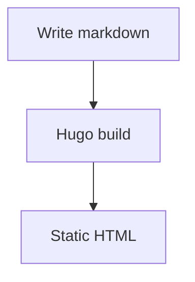

This is the first post on the site. It exists to confirm that code blocks, math, and diagrams all render correctly.

## Code

```python
def fibonacci(n: int) -> int:
    if n < 2:
        return n
    return fibonacci(n - 1) + fibonacci(n - 2)

print(fibonacci(10))
```

## Math

A famous identity: $E = mc^2$.

A closed-form sum:

$$\sum_{i=1}^n i = \frac{n(n+1)}{2}$$

## Diagrams

A simple flow diagram:


